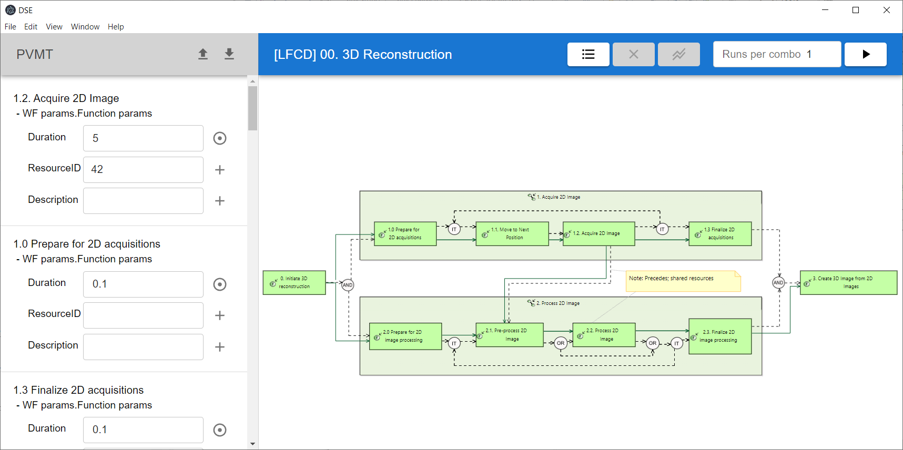

# Capella Workflow 

A Capella addon for doing design space exploration (DSE) on Capella workflow models. 



Standalone version can be downloaded from the [release page](https://github.com/TNO/capella-workflow-dse/releases), this includes:
- This addon
- [Capella 5.2.0](https://www.eclipse.org/capella/)
- [POOSL](https://www.poosl.org/)
- [Eclipse TRACE4CPS](https://projects.eclipse.org/projects/technology.trace4cps)
- [Rotalumis](https://www.es.ele.tue.nl/poosl/Tools/rotalumis/)
- [Property Values Management Tools (PVMT)](https://www.eclipse.org/capella/addons.html)

More info:
- Paper: TODO
- Tutorial: TODO

## Setup development environment
To setup a development environment (Windows only):
1. First make sure the prerequisites are installed on your machine: Python 3.10, Maven, Java 14 and Node.js 18
1. Remove the [Windows `MAX_PATH` limitation](https://docs.python.org/3/using/windows.html#removing-the-max-path-limitation)
1. Download and start the [Eclipse installer](https://www.eclipse.org/downloads/)
1. In the right-top click the "hamburger" -> "ADVANCED MODE..."
1. Select "Eclipse IDE for Eclipse Committers", set "Product Version" to "2020-06" and point "Java 1.8+ VM" to the location of Java 14, click "Next" twice.
1. Change "Installation folder name" to "capella-workflow-dse", click "Next" and "Finish"
1. Start Eclipse
1. Clone this repository, navigate to it in a terminal and execute:
    ```bash
    mvn clean verify -f releng/nl.tno.capella.workflow.dse.target/pom.xml
    mvn clean package
    ```
1. In Eclipse, press "Import projects..." -> "General" -> "Existing Projects into Workspace", click "Next"
1. Click "Browse" next to "Select root directory" point it to the root of the cloned repository, click "Finish"
1. Open `nl.tno.capella.workflow.dse.target/platform.target`, click "Set as Active Target Platform"
1. The development environment is now ready:
    - To launch the product, right click `nl.tno.capella.workflow.dse/Product.launch` -> "Run As" -> "Product"
    - To launch the tests, right click `nl.tno.capella.workflow.dse.test/Test.launch` -> "Run As" -> "Test"
    - To launch the app, open a terminal, navigate to `plugins/nl.tno.capella.workflow.dse.app/app` and execute `npm start -- -- "../../../tests/nl.tno.capella.workflow.dse.test/model/3D Reconstruction"`
        - Before doing this make sure you launched the DSE at least once via the product (`tests/nl.tno.capella.workflow.dse.test/model/3D Reconstruction/gen/dse` has to exist)
